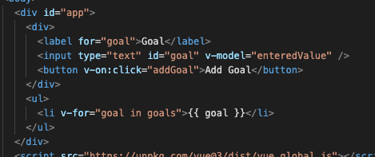
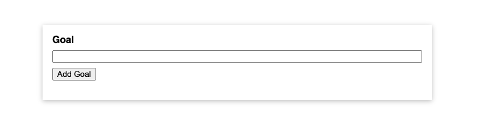
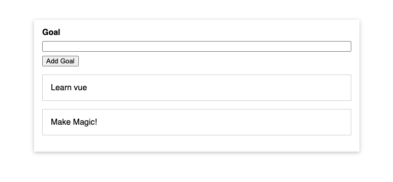

# Comparing JavaScript with Vue

## Introduction

Project is a Goal Tracker. 

Aim is to see the difference between Vue and JavaScript. 

Folder Structure: 

* app.js
* index.html
* styles.css

___

## Highlights

Add vue script in index file BEFORE your app script.

Create a application instance with createApp function.

```
Vue.createApp({
    data() {
        return {
            anArray: [],
        };
    },
    methods: {
        addGoal() {
            this.goals.push(this.enteredValue);
            this.enteredValue = '';
        }
    }
}).mount('#app');

```

Mount the app. This is .mount('#app'), where # is targeting the div id in the html file. 


index.html has in-DOM Root components that target Add Goal:

v-model="enteredValued" targets the input field

v-on:click="addGoal" targets the button 

v-for="goal in goals" targets the li element to loop over and display the goals entered.



___

## Completed





## Resources

Vue Documentation: https://vuejs.org/guide/introduction.html

Udemy Course: Vue - The Complete Guide (incl. Router & Composition API) by Maximilian Schwarzmüller